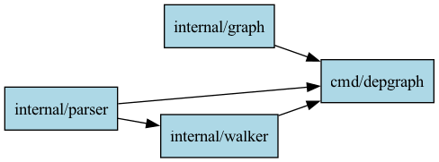

# Go Package Dependency Graph Generator

This project analyzes a Go project and generates a **Graphviz** `.dot` file representing **internal package dependencies**.

## Features
- Extracts **module name** from `go.mod`
- Recursively scans directories for `.go` files
- **Excludes** `_test.go` files and `_test` packages
- Collects **internal package imports** (relative to the module)
- Outputs a **Graphviz `.dot` file** for visualization

## Project Structure

```plaintext
depgraph/
├── go.mod                     # Module definition
├── cmd/
│   └── depgraph/
│       └── main.go            # CLI entrypoint
├── internal/
│   ├── parser/
│   │   └── parser.go          # Parsing go.mod and Go file imports
│   ├── graph/
│   │   └── graph.go           # Graphviz .dot file generation
│   └── walker/
│       └── walker.go          # Directory walking and dependency collection
└── testdata/                  # Sample files for testing
```

## Usage
1. **Build & Run**
   ```bash
   go run ./cmd/depgraph
   ```
   This will generate a graph.dot file in the current directory.

2.	Generate PNG  
Use Graphviz to convert the .dot file:

    ```bash
    dot -Tpng graph.dot -o graph.png
    ```

3.	View
    Open graph.png with any image viewer to see the package dependency graph.

## Example Output
graph.dot:


make_graph.sh:

    ```bash
    dot -Tpng graph.dot -o graph.png 
    ```

result image:  


## Why?
•	Visualize internal package dependencies at a glance.
•	Detect unwanted cross-package dependencies.
•	Useful for large Go projects to keep architecture clean.

## Future Improvements
•	Add external package visualization (different colors for stdlib, third-party, internal).
•	Group packages by directory clusters.
•	Interactive web-based visualization (e.g., D3.js).

## Requirements
•	Go 1.24+
•	Graphviz for rendering .dot files

## License

MIT
